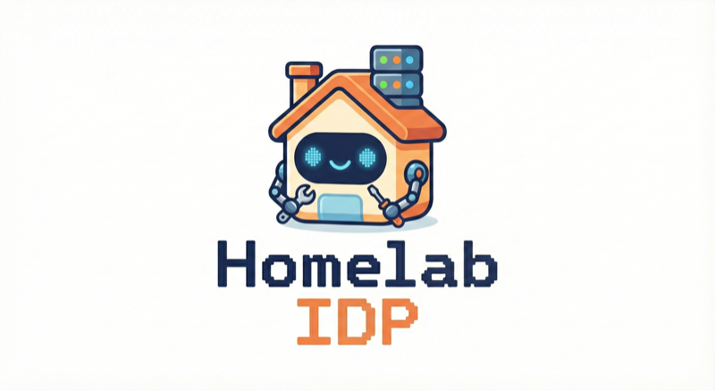

<p align="center">
  
  <br>
  <em>A self-managing internal developer platform for your homelab.</em>
</p>

## Overview

This repository bootstraps an IDP and then hands ongoing management to GitOps workflows:

- **Ansible** provisions a single-node k3s cluster on your target server
- **Terraform** deploys core platform services and runs a one-time bootstrap job
- **Bootstrap job** creates Gitea repos, pushes platform configs, and wires ArgoCD to Gitea
- **ArgoCD** takes over and manages platform applications via GitOps

After bootstrap completes, you have a self-managing platform where:
- Core infrastructure (Cilium, Gitea, ArgoCD) is managed via Terraform in Gitea
- Platform applications are managed via ArgoCD pulling Helm charts from Gitea

## Architecture

### Bootstrap Flow

```
┌────────────────────────────────────────────────────────────────────────────┐
│                              LOCAL MACHINE                                 │
├────────────────────────────────────────────────────────────────────────────┤
│                                                                            │
│  ┌──────────────┐      ┌──────────────┐      ┌──────────────────────────┐  │
│  │  1. Config   │      │  2. Ansible  │      │      3. Terraform        │  │
│  │              │      │              │      │                          │  │
│  │ homelab.yml  │─────>│  Provision   │─────>│  Deploy core services    │  │
│  │      +       │      │ k3s cluster  │      │  + Run bootstrap job     │  │
│  │   render-    │      │              │      │                          │  │
│  │  config.py   │      └──────────────┘      └──────────────────────────┘  │
│  └──────────────┘              │                          │                │
│                                │                          │                │
└────────────────────────────────│──────────────────────────│────────────────┘
                                 │                          │
                                 v                          v
┌─────────────────────────────────────────────────────────────────────────────┐
│                              K3S CLUSTER                                    │
├─────────────────────────────────────────────────────────────────────────────┤
│                                                                             │
│  ┌────────────────────────────────────────────────────────────────────────┐ │
│  │                    TERRAFORM-MANAGED (core)                            │ │
│  │  ┌──────────┐  ┌──────────┐  ┌──────────┐  ┌─────────────────────────┐ │ │
│  │  │  Cilium  │  │  Gitea   │  │  ArgoCD  │  │  ArgoCD ApplicationSet  │ │ │
│  │  │   (CNI)  │  │  (Git)   │  │   (CD)   │  │ (watches platform-apps) │ │ │
│  │  └──────────┘  └──────────┘  └──────────┘  └─────────────────────────┘ │ │
│  └────────────────────────────────────────────────────────────────────────┘ │
│                                     │                                       │
│  ┌──────────────────────────────────│─────────────────────────────────────┐ │
│  │         BOOTSTRAP JOB            │                                     │ │
│  │  ┌────────────────────────────┐  │                                     │ │
│  │  │  1. Create Gitea org/repos │  │                                     │ │
│  │  │  2. Push platform-core     │<─┘                                     │ │
│  │  │  3. Push platform-apps     │────────────────────┐                   │ │
│  │  │  4. Wire ArgoCD to Gitea   │                    │                   │ │
│  │  └────────────────────────────┘                    │                   │ │
│  └────────────────────────────────────────────────────│───────────────────┘ │
│                                                       │                     │
│  ┌────────────────────────────────────────────────────│───────────────────┐ │
│  │                    ARGOCD-MANAGED (apps)           v                   │ │
│  │  ┌──────────────┐  ┌───────────────┐  ┌─────────┐ ┌──────────────────┐ │ │
│  │  │ cert-manager │  │ ingress-nginx │  │ metallb │ │ external-secrets │ │ │
│  │  └──────────────┘  └───────────────┘  └─────────┘ └──────────────────┘ │ │
│  │  ┌─────────┐  ┌──────────────────┐  ┌──────────────┐  ┌─────────┐      │ │
│  │  │  vault  │  │  cloudnative-pg  │  │  crossplane  │  │  minio  │      │ │
│  │  └─────────┘  └──────────────────┘  └──────────────┘  └─────────┘      │ │
│  └────────────────────────────────────────────────────────────────────────┘ │
│                                                                             │
└─────────────────────────────────────────────────────────────────────────────┘
```

### Post-Bootstrap Ownership

After bootstrap completes, two repositories exist in Gitea under `homelab/`:

```
┌─────────────────────────────────────────────────────────────────────────────┐
│                         GITEA (homelab org)                                 │
├───────────────────────────────────┬─────────────────────────────────────────┤
│     homelab/platform-core         │        homelab/platform-apps            │
├───────────────────────────────────┼─────────────────────────────────────────┤
│                                   │                                         │
│  Terraform code for core infra    │  Helm charts for platform apps          │
│                                   │                                         │
│  ├── main.tf                      │  ├── core/                              │
│  ├── providers.tf                 │  │   ├── cert-manager/                  │
│  ├── variables.tf                 │  │   ├── ingress-nginx/                 │
│  ├── terraform.tfvars             │  │   └── metallb/                       │
│  └── core/                        │  ├── security/                          │
│      ├── cilium/                  │  │   ├── external-secrets/              │
│      ├── gitea/                   │  │   └── vault/                         │
│      ├── argocd/                  │  ├── storage/                           │
│      └── argocd-appset/           │  │   ├── cloudnative-pg/                │
│                                   │  │   └── minio/                         │
│  Manages:                         │  └── controlplane/                      │
│  - Cilium CNI                     │      └── crossplane/                    │
│  - Gitea git server               │                                         │
│  - ArgoCD + ApplicationSet        │  Managed by: ArgoCD (GitOps)            │
│                                   │  Each Chart.yaml = one ArgoCD App       │
│  Managed by: Terraform            │                                         │
│  (run from this repo or cluster)  │                                         │
│                                   │                                         │
├───────────────────────────────────┴─────────────────────────────────────────┤
│  NOTE: Bootstrap-only files are EXCLUDED from platform-core:                │
│  - bootstrap.tf, variables-bootstrap.tf, bootstrap.auto.tfvars              │
│  - core/gitops-bootstrap/                                                   │
│  These only run once and are not needed post-provisioning.                  │
└─────────────────────────────────────────────────────────────────────────────┘
```

### Ownership Summary

| Component | Managed By | Repository |
|-----------|------------|------------|
| Cilium (CNI) | Terraform | `homelab/platform-core` |
| Gitea | Terraform | `homelab/platform-core` |
| ArgoCD | Terraform | `homelab/platform-core` |
| ArgoCD ApplicationSet | Terraform | `homelab/platform-core` |
| cert-manager | ArgoCD | `homelab/platform-apps` |
| ingress-nginx | ArgoCD | `homelab/platform-apps` |
| metallb | ArgoCD | `homelab/platform-apps` |
| external-secrets | ArgoCD | `homelab/platform-apps` |
| vault | ArgoCD | `homelab/platform-apps` |
| cloudnative-pg | ArgoCD | `homelab/platform-apps` |
| minio | ArgoCD | `homelab/platform-apps` |
| crossplane | ArgoCD | `homelab/platform-apps` |

## Prerequisites

- Python 3 with PyYAML (`pip install pyyaml`)
- Ansible (`pip install ansible`)
- Terraform
- kubectl
- A target server running Ubuntu with SSH access

## Quick Start

### 1. Configure

Copy and edit the configuration file:

```bash
cp config/homelab.example.yml config/homelab.yml
# Edit config/homelab.yml with your values
```

Generate Ansible inventory and Terraform variables:

```bash
python3 scripts/render-config.py
```

This creates:
- `bootstrap/ansible/inventory/hosts`
- `bootstrap/terraform/terraform.tfvars`
- `bootstrap/terraform/bootstrap.auto.tfvars`

### 2. Provision k3s Cluster

See [bootstrap/ansible/README.md](bootstrap/ansible/README.md) for detailed Ansible usage.

**Quick version:**

```bash
# Generate SSH key for Ansible
mkdir -p ~/.ssh/homelab
ssh-keygen -t ed25519 -f ~/.ssh/homelab/homelab_ansible -C "ansible@homelab"

# Ensure target has Python
ssh <user>@<server-ip> "sudo apt update && sudo apt install -y python3"

# Create ansible account (from bootstrap/ansible/)
cd bootstrap/ansible
ANSIBLE_PASSWORD='your-secure-password' \
  ansible-playbook -u <bootstrap-user> playbooks/create_account.yml --ask-pass --ask-become-pass

# Install k3s (automatically fetches kubeconfig)
ansible-playbook -u ansible playbooks/install_k3s.yml \
  --private-key ~/.ssh/homelab/homelab_ansible --ask-become-pass

# Verify
kubectl config use-context homelab
kubectl get nodes
```

### 3. Bootstrap Platform

```bash
cd bootstrap/terraform
terraform init
terraform plan
terraform apply
```

This deploys:
1. Cilium (CNI)
2. Gitea (git server)
3. ArgoCD (continuous deployment)
4. Bootstrap job that:
   - Creates `homelab` organisation, `argocd-bot` user in Gitea
   - Creates `platform-core` and `platform-apps` repos
   - Pushes Terraform and Helm configs to Gitea
   - Configures ArgoCD to pull from Gitea via `argocd-repositories` secret in `argocd` namespace

### 4. Verify

```bash
# Check ArgoCD apps are syncing
kubectl get applications -n argocd
```

## Configuration Reference

`config/homelab.yml` structure:

```yaml
cluster:
  server_ip: 10.0.0.10           # Target server IP

network:
  metallb_ip_range: 10.0.0.20-10.0.0.30  # LoadBalancer IP pool

ingress:
  base_domain: lab               # Base domain for services
  prefixes:
    argocd: cd                   # cd.lab
    gitea: git                   # git.lab
    vault: secrets               # secrets.lab
```

## Post-Bootstrap Operations

### Configure DNS

Platform services are exposed via ingress using hostnames defined in `config/homelab.yml`. Your local DNS must resolve these hostnames to the MetalLB LoadBalancer IP (the first IP in `network.metallb_ip_range`).

Based on the default configuration, create DNS entries for:

| Hostname | Service | Source |
|----------|---------|--------|
| `cd.lab` | ArgoCD | `ingress.prefixes.argocd` |
| `git.lab` | Gitea | `ingress.prefixes.gitea` |
| `secrets.lab` | Vault | `ingress.prefixes.vault` |
| `storage.lab` | MinIO Console | `ingress.prefixes.minio` |
| `s3.lab` | MinIO API | `ingress.prefixes.minio_api` |

All entries should point to your LoadBalancer IP (e.g., `10.0.0.20`).

**OPNsense/Unbound**: Configure in **Services > Unbound DNS > Host Overrides**.

**Pi-hole**: Add entries in **Local DNS > DNS Records**.

**Other DNS**: Add A records in your DNS server or `/etc/hosts` for testing.

After adding entries, flush your local DNS cache:

```bash
# macOS
sudo dscacheutil -flushcache && sudo killall -HUP mDNSResponder

# Linux
sudo systemd-resolve --flush-caches

# Windows
ipconfig /flushdns
```

### Trust the Cluster CA

Export and trust the root CA for browser access:

```bash
./scripts/get-ca-cert.sh
# Follow instructions to add to your system trust store
```

### Migrate Terraform State to MinIO

After bootstrap, Terraform state exists as a local file. For collaboration, state locking, and GitOps compatibility, migrate it to MinIO (S3-compatible storage) running in your cluster.

This migration excludes bootstrap-only resources (`module.gitops_bootstrap`) that are no longer needed.

See [docs/terraform-state-migration.md](docs/terraform-state-migration.md) for the complete migration guide.

### Adding a New Platform App

1. Clone `homelab/platform-apps` from Gitea
2. Create a new chart in `platform-apps/<category>/<app-name>/`
3. Push to `homelab/platform-apps` in Gitea
4. ArgoCD automatically detects and deploys it

### Modifying Core Infrastructure

1. Clone `homelab/platform-core` from Gitea
2. Make Terraform changes
3. Run `terraform plan` and `terraform apply`
4. Push changes back to Gitea

## Credentials

```bash
# Gitea admin
kubectl get secret -n gitea gitea-admin-credentials -o jsonpath='{.data.username}' | base64 -d
kubectl get secret -n gitea gitea-admin-credentials -o jsonpath='{.data.password}' | base64 -d

# ArgoCD admin
kubectl get secret -n argocd argocd-initial-admin-secret -o jsonpath='{.data.password}' | base64 -d

# MinIO API + Console
kubectl get secret -n minio minio -o jsonpath='{.data.root-user}' | base64 -d
kubectl get secret -n minio minio -o jsonpath='{.data.root-password}' | base64 -d
```

### Vault Credentials

Vault is configured to auto-initialise and auto-unseal. On first startup, it creates a secret containing the root token and unseal keys:

```bash
kubectl get secret -n vault vault-init-credentials -o jsonpath='{.data}' | jq
```

The secret contains:
- `root-token` - Vault root token for administrative access
- `unseal-key-1`, `unseal-key-2`, `unseal-key-3` - Shamir unseal keys

> **Warning**: Back up this secret immediately. If `vault-init-credentials` is deleted and you cannot recover the root token and unseal keys, you will permanently lose access to all data stored in Vault.

## Troubleshooting

| Issue | Solution |
|-------|----------|
| Bootstrap job stuck | `kubectl logs -n gitea job/<job-name>` |
| ArgoCD not syncing | Verify `argocd-repositories` secret exists in `argocd` namespace |
| App not deploying | Confirm `Chart.yaml` exists in `platform-apps/<category>/<app>/` |
| Kubeconfig not working | Re-run `ansible-playbook playbooks/fetch_kubeconfig.yml` |

## Directory Structure

```
homelab/
├── config/
│   ├── homelab.example.yml     # Configuration template
│   └── homelab.yml             # Your local config (gitignored)
├── scripts/
│   ├── render-config.py        # Generate inventory + tfvars
│   └── get-ca-cert.sh          # Export cluster CA certificate
├── bootstrap/
│   ├── ansible/                # k3s provisioning
│   │   ├── ansible.cfg
│   │   ├── inventory/hosts     # Generated
│   │   ├── playbooks/
│   │   └── ansible_collections/
│   └── terraform/              # Platform bootstrap
│       ├── main.tf             # Core modules
│       ├── bootstrap.tf        # Bootstrap-only (not pushed to Gitea)
│       ├── variables.tf
│       ├── variables-bootstrap.tf
│       └── core/
│           ├── cilium/
│           ├── gitea/
│           ├── argocd/
│           ├── argocd-appset/
│           └── gitops-bootstrap/  # One-time bootstrap job
└── platform-apps/              # Helm charts for ArgoCD
    ├── core/
    ├── security/
    ├── storage/
    └── controlplane/
```
