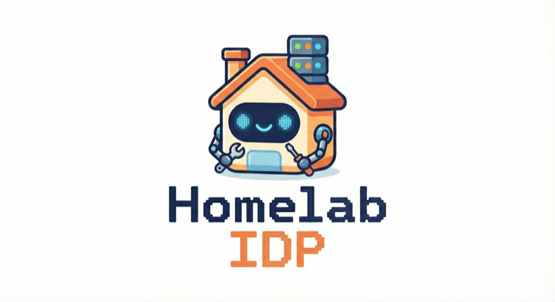

<p align="center">
  
  <br>
  <em>A self-managing internal developer platform for your homelab.</em>
</p>

## Overview

Homelab IDP turns a single Kubernetes cluster into a fully self-managing developer platform with SSO, secret management, object storage, CI/CD, and GitOps — all wired together and secured with internal TLS.

- **Bootstrap once**: Ansible provisions k3s, Terraform deploys Cilium + Gitea + ArgoCD and seeds the GitOps repo.
- **Self-managing**: ArgoCD's ApplicationSet auto-discovers every chart in `platform-core/` — add a directory, get a deployed service.
- **Eventual consistency**: Services start in whatever order they can, retry on missing dependencies, and converge to a healthy state without manual intervention.
- **Day-2 workflow**: Clone `platform-core` from Gitea, edit, push. ArgoCD handles the rest.

## What Gets Installed

Platform services managed by ArgoCD from `platform-core/`:

| Category | Service | Description |
|----------|---------|-------------|
| **GitOps** | ArgoCD | Continuous deployment from Gitea |
| **Developer** | Gitea + Actions | Git server with CI/CD runners |
| **Auth** | Keycloak | OIDC identity provider (SSO for all services) |
| **Networking** | Cilium | CNI and network policy |
| **Networking** | MetalLB | Bare-metal LoadBalancer IPs |
| **Networking** | Traefik | Gateway API ingress with TLS termination |
| **Networking** | oauth2-proxy | Forward auth for OIDC-protected services |
| **Security** | cert-manager | Internal PKI (self-signed root CA) |
| **Security** | trust-manager | CA certificate distribution across namespaces |
| **Security** | Vault | Secret management |
| **Security** | External Secrets | Vault-to-Kubernetes secret synchronization |
| **Storage** | RustFS | S3-compatible object storage |
| **Storage** | CloudNativePG | PostgreSQL operator |
| **Controlplane** | Crossplane | Infrastructure compositions (Gitea, Vault, Keycloak, Postgres) |

For deeper bootstrap internals, see `docs/terraform-bootstrap-handoff.md`.

## Quick Start (Kind)

Use this path to validate the platform on a local disposable cluster.

Prerequisites:

- `kind`, `kubectl`, `terraform`
- `python3` + `pyyaml`
- `curl`, `jq`, `git`, `sed`
- Container runtime: Docker or Podman (rootful mode)
- Recommended: 6 CPUs, 12 GiB RAM

```bash
# 1. Create local config from the kind profile
cp config/homelab.kind.example.yaml config/homelab.yaml

# 2. Render config into tfvars/inventory/platform-core values
python3 scripts/render-config.py --config config/homelab.yaml

# 3. Create the kind cluster
kind create cluster --config docs/examples/kind-homelab.yaml --wait 0

# 4. Bootstrap platform
cd bootstrap/terraform
terraform init
terraform apply -var kubeconfig_context=kind-homelab -var kubeconfig_path=~/.kube/config

# 5. (Optional) Patch CoreDNS for *.local.lab DNS inside the cluster
bash docs/examples/kind-patch-dns.sh

# 6. Verify
kubectl get applications -n argocd
```

### Accessing UIs (Kind + Podman)

MetalLB IPs are not routable from the host with Kind + Podman. Use port-forwards:

```bash
# ArgoCD UI
kubectl port-forward svc/argocd-server -n argocd 8080:80
# -> http://localhost:8080

# Gitea
kubectl port-forward svc/gitea-http -n gitea 3000:3000
# -> http://localhost:3000

# RustFS Console
kubectl port-forward svc/rustfs-svc -n rustfs 9001:9001
# -> http://localhost:9001

# Vault
kubectl port-forward svc/vault -n vault 8200:8200
# -> http://localhost:8200
```

### Initial Credentials

```bash
# ArgoCD (username: admin)
kubectl -n argocd get secret argocd-initial-admin-secret -o jsonpath='{.data.password}' | base64 -d; echo

# Gitea (username: admin)
kubectl -n gitea get secret gitea-admin -o jsonpath='{.data.password}' | base64 -d; echo

# RustFS
kubectl -n rustfs get secret rustfs-root-credentials -o jsonpath='{.data.RUSTFS_ACCESS_KEY}' | base64 -d; echo
kubectl -n rustfs get secret rustfs-root-credentials -o jsonpath='{.data.RUSTFS_SECRET_KEY}' | base64 -d; echo

# Vault
kubectl -n vault get secret init-credentials -o jsonpath='{.data.root-token}' | base64 -d; echo
```

### Cleanup

```bash
kind delete cluster --name homelab
```

Full local runbook (including Podman/WSL notes): `docs/install-kind.md`

## Recommended Deployment (k3s)

For long-lived homelab use, install onto a real host with k3s:

1. Copy `config/homelab.k3s.example.yaml` to `config/homelab.yaml`
2. Render config with `scripts/render-config.py`
3. Provision k3s with Ansible
4. Run Terraform bootstrap
5. Configure DNS + trust cluster CA

Start here: `docs/install-k3s.md`

## Configuration

Use one of the provided templates as your starting point:

- `config/homelab.kind.example.yaml` — local Kind testing
- `config/homelab.k3s.example.yaml` — real k3s deployment

Key config sections:

```yaml
dns:
  base_domain: local.lab       # Hostnames built as {prefix}.{base_domain}
  prefixes:
    argocd: cd                 # -> cd.local.lab
    gitea: git                 # -> git.local.lab
    keycloak: auth             # -> auth.local.lab
    traefik: gateway           # -> gateway.local.lab
    vault: secrets             # -> secrets.local.lab
    rustfs_console: storage    # -> storage.local.lab (RustFS console)
    rustfs_api: s3             # -> s3.local.lab (S3 API)

network:
  traefik_loadbalancer_ip: ... # Traefik Gateway API LB
  gitea_ssh_loadbalancer_ip: . # Gitea SSH LB

admin:
  first_name: Lab              # Keycloak admin profile
  last_name: Admin
  email: admin@local.lab
```

Full config reference: `docs/configuration.md`

## Post-Bootstrap Workflow

After bootstrap succeeds:

1. Clone `homelab/platform-core` from your Gitea instance
2. Edit Helm chart values or add chart directories
3. Push changes to Gitea
4. ArgoCD reconciles automatically

## Documentation Map

- `docs/install-kind.md` — local Kind install and verification
- `docs/install-k3s.md` — recommended real deployment path
- `docs/configuration.md` — `homelab.yaml` schema, defaults, environment profiles
- `docs/ansible-k3s-provisioning.md` — detailed Ansible playbooks and role vars
- `docs/terraform-bootstrap-handoff.md` — Terraform bootstrap and ArgoCD takeover internals
- `docs/secrets-management.md` — Vault/ESO/Crossplane architecture
